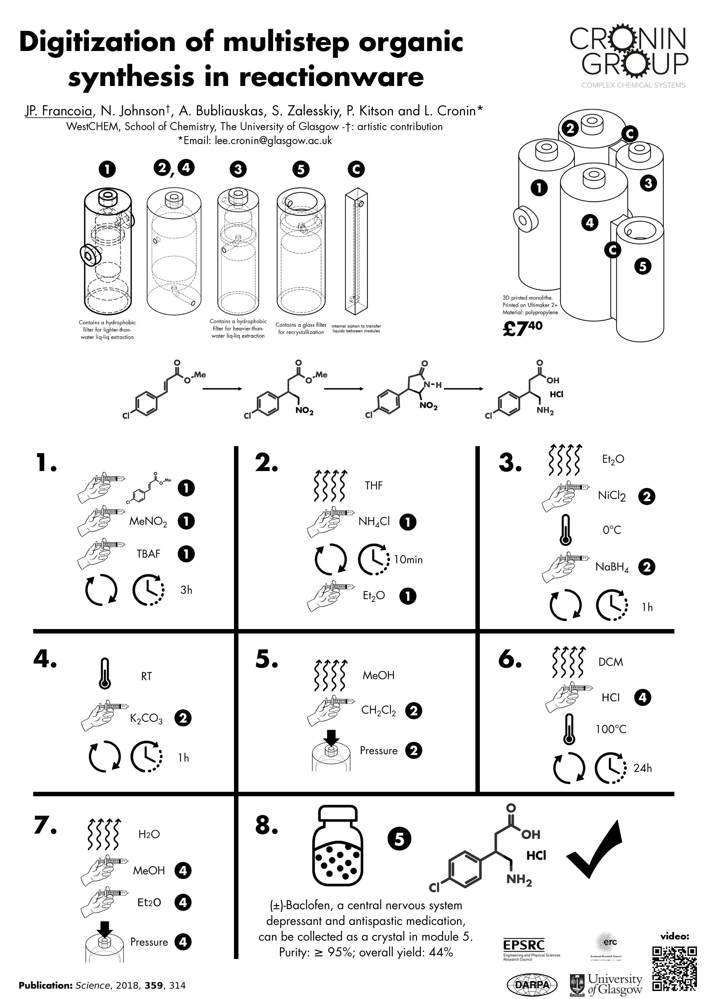
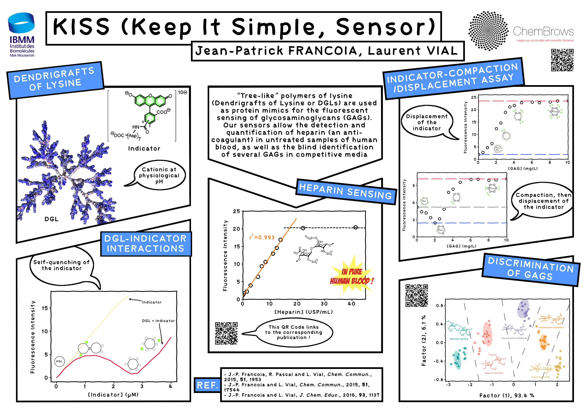
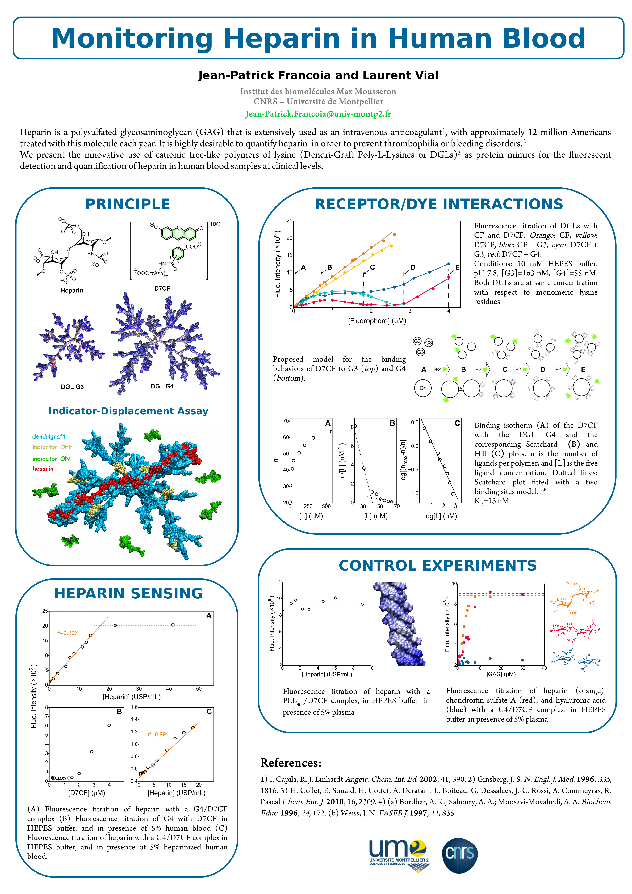
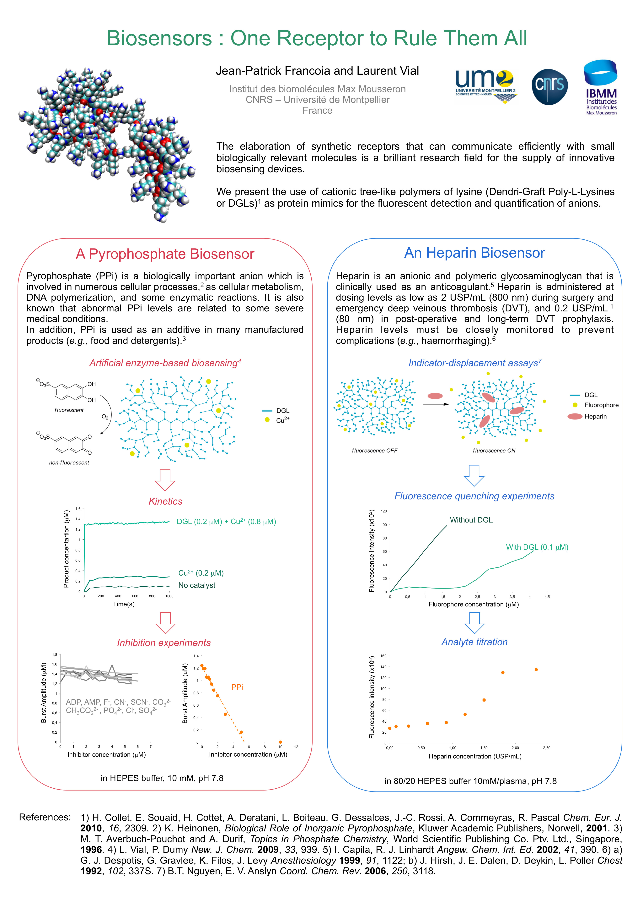

My posters and oral presentations, for all the conferences I attended.

 

# Welcome Genome Campus hackathon, Hinxton, United Kingdom

Website: [here](https://www.sanger.ac.uk/innovations/hackathon2018)

I chose to compete in the Medicine Discovery Catapult’s challenge:
*How can we combine drug and genetic data to intelligently prescribe drugs?*

The code we came up with as a team is located [here](https://github.com/JPFrancoia/WCG_hackathon)

Note: not all the code is mine, and the code was written in a *hackathon
spirit*: quick and dirty...

 

# RSC Twitter Poster Conference 2018, Twitter, World

Website: [here](http://blogs.rsc.org/rscpublishing/2017/12/14/rsc-twitter-poster-conference-2018/)

The poster conference happened on Twitter: [#RSCPoster](https://twitter.com/hashtag/RSCPoster?src=hash)

You can find my tweet for the competition
[here](https://twitter.com/hashtag/RSCPoster?src=hash) (50 retweets and 104
likes at the end of the competition !!! The most liked/retweeted poster in
the category #RSCorg)

 

# JMJC 2016, Nice, France

Website: [here](http://rjscfpacalr.wixsite.com/jmjc2016)

Just a poster for this conference, I reused the KISS poster:
[2016_msmlg_bath](posters/2016_msmlg_bath.jpg)

 

# MSMLG 2016, Bath, United Kingdom

Flyer of the conference: [here](flyers/2016_msmlg_bath.pdf)

My poster for this conference (number 24):

I also had a flash slot (10 min): [KISS (Keep It Simple,
Sensor)](presentations/2016_msmlg_bath.pdf)

 

# JMJC 2015, Montpellier, France

Flyer of the conference: [here](flyers/2015_jmjc_montpellier.pdf)

No poster for this conference, but an oral presentation (10 min): [KISS
(Keep It Simple, Sensor)](presentations/2015_jmjc_montpellier.pdf)

 

# MeMoSim 2015, Lyon, France

Website: [here](https://memosim2015.sciencesconf.org/)

Poster for the conference:

 

# Balard Chemistry Conferences 2014, La Grande Motte, France 

Flyer of the conference: [here](flyers/2014_balard_la_grande_motte.pdf)

Poster for the conference (yes, I used the same poster for MeMoSim...):

 

# JJC 2014, Montpellier, France

Flyer of the conference: [here](flyers/2014_jjc_montpellier.pdf)

Poster for the conference (I had just started my PhD...):

